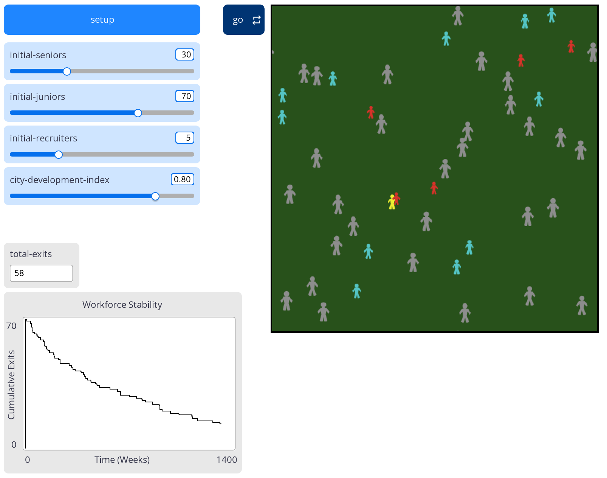
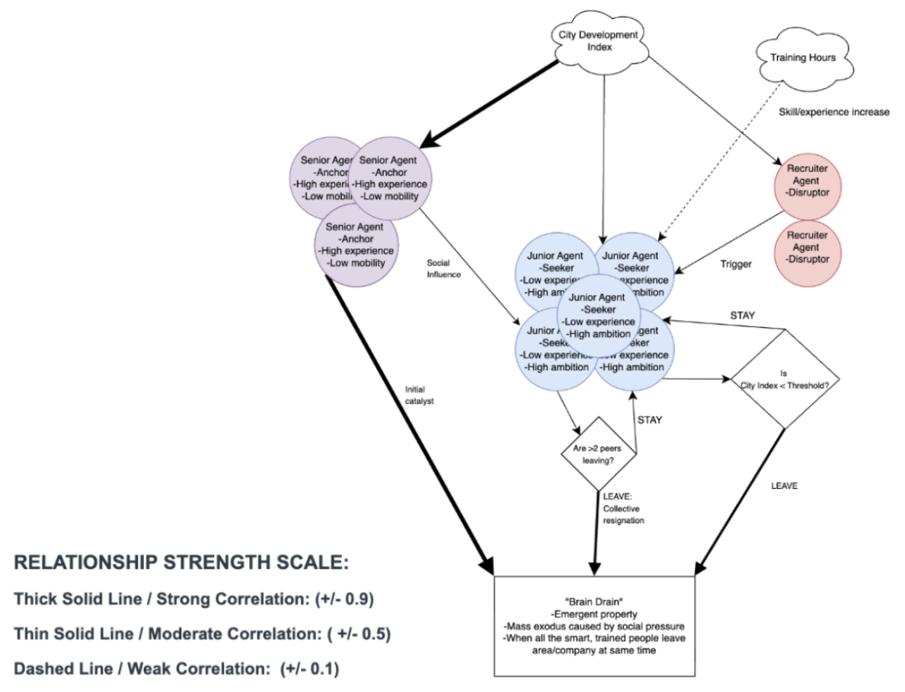

# Brain-Drain-Simulation
ABM simulation on workforce attrition and 'brain drain' through social contagion and economic threshold analysis. Developed in NetLogo with statistical analysis in Python. 

---

### Visualization

Figure 01: NetLogo simulation interface 

Figure 02: Schematic used to establish model dynamics.

---

### Overview
The primary purpose is to simulate "brain drain" within a corporate data science environment. The aim is to see whether mass job migration is driven more by social aspects or by individual economic choices. By isolating variables, the model identifies the tipping point that causes an otherwise stable workforce to collapse.

---

### Entities and Attributes
Consists of three active agent entities and one passive environmental entity:
* **Senior Data Scientists:** High experience and a static economic "leave threshold."
* **Junior Data Scientists:** Dynamic state variables including internal stress levels and a training hours counter.
* **Recruiters:** Spatial coordinates and random mobility parameters.
* **Virtual Job Market:** 2D grid representing the professional ecosystem.

---

### Kaggle Dataset

*HR Analytics: Job Change of Data Scientists*. 

Correlation analysis from this dataset provided the basis for the relationship between CDI and senior attrition.

---

### Findings
* **Tipping Point:** Analysis shows how the environment remains stable stability until the CDI reaches a critical threshold (typically between 0.2 and 0.4).
* **Social Influence:** Results imply social contagion is a more powerful factor in mass resignations than individual economic factors, with senior departures acting as the primary catalyst for system failure.

---

### Structure
* `brainDrain_model.nlogox`: NetLogo source code.
* `cdi_sensitivityAnalysis.ipynb`: Jupyter notebook with Seaborn visualizations and data interpretations.
* `cdi_experiment_results.csv`: Raw data generated from 70 experimental simulation runs.
* `brainDrain_model.html`: Standalone web export of the simulation interface.
* `simulation_preview.png` & `modelSchematic.png`: Documentation visuals.

---

### Usage 
1.  **Running the Model:** Open `brainDrain_model.nlogox`, click **Setup**, and then **Go**.
2.  **Data Analysis:** Open `cdi_sensitivityAnalysis.ipynb`. 

---

###  License
MIT License
